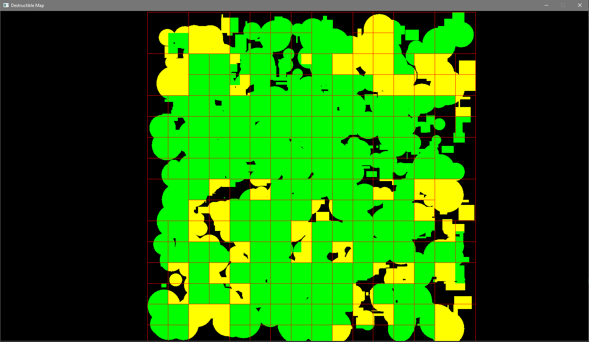
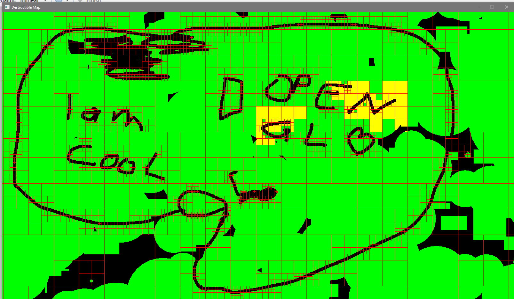
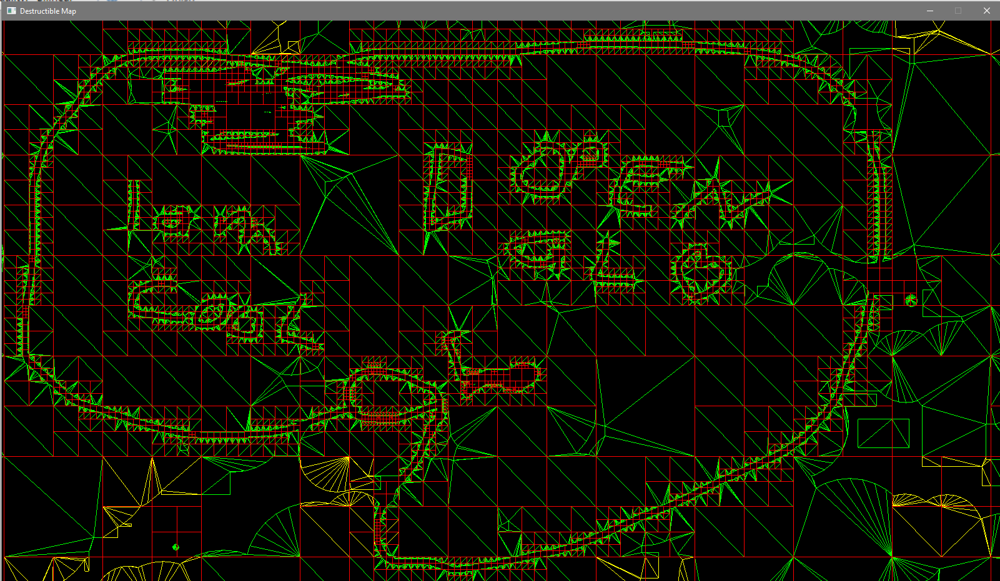

# OpenGL Destructible Map
A Worms style 2D destructible map implemented in OpenGL without using Pixmaps. This is developed as the project for the "Design and Development of Rendering Engines" course at University of Technology Vienna.

The map can be any simple polygon of (practically) arbitrary size. This map can then be manipulated using boolean operations intersection (union, intersection, difference and XOR) in realtime.

This system has the following advantages in comparison to regular pixmap based approaches:
 * Less memory consumption: Only vertices have to be stored, instead of pixels. This allows very big worlds
 * Plays well with physics engines: Since the map is available as a triangle soup sophisticated physics is possible using conventional physics engines
 * "infinite zoom": The map will never appear blurry/pixelated when zooming in, since the map is in a vector format

The disadavantages are:
 * Changing the map is a quite costly operation
 * Keeping the number of draw calls low is difficult
 * Numerical instability of polygon clipping operations
 
All of these disadvantages are minimized by this project to a degree which makes this feasible for real games.

## Implementation Overview

### Start up
At first the engine generates the map polygon, which can be an arbitrary size and complexity. After that a monte carlo point cloud approximation of the polygon is generated, where each point represents the density at its location. Each leaf of the quad tree (from now on called Chunk) has a capacity of points, and if this capacity is exceeded the chunk is turned into a inner chunk (which means it does not have any polygon and vertices assigned) and 4 new chunks are created for the inner chunk. By using this technique the initial quadtree is a quite good segmentation of the map polygon. Locations in the map that have no polygon area have a very sparse quadtree, while locations that are covered by the map polygon have a dense quadtree.

After the initial quadtree has been generated the map polygon is applied to each chunk. Each polygon covers a certain square of the map. Each chunk does an intersection with its assigned area and the map polygon. This results in quite small polygons (regarding the number of points) for each chunk. The reason why this is done like this, is simple: Doing polygon clipping on a big polygon is very costly and is not feasible in realtime, while doing clipping on small polygons, although being still quite slow, is possible in real time. After the clipping is done the triangulation takes place, which generates a renderable triangle soup.

What do we have now after loading the map?
 * A quad tree representing the "density" of the polygon using monte carlo point cloud approximation
 * Each chunk of the quadtree has its own "sub" polygon where boolean operations are possible in real time
 * Each chunk has a renderable triangle soup

This set up offers enough information to be rendered and modified efficiently.

### Rendering
Now an easy way of rendering would be to generate a VAO and VBO for each chunk and just render them naively. The problem with this approach is, that draw calls are expensive and reducing is key for realtime rendering, especially for mobile devices. This project basically tries to pack as many chunks as possible into drawing batches. But how is this done?

At first a pool of Drawing Batches is generated. This is a very slow operation, so this should not be done during runtime, luckily we can created lots of the beforehand.

After the intial map is generated each chunk is marked as being dirty. If a chunk is dirty, this means that the vertices have changed and the drawing batch must be updated accordingly.

Before the map is being rendered all dirty chunks are gathered in the quad tree. These chunks need to be assigned to a drawing batch. A drawing batch is basically a VAO with a VBO and some clever data structures that allow dynamic modifications of the assigned chunks. Each drawing batch has a maximum size of vertices and chunks are assigned as long as the capacity allows it. 

At the first drawing of the scene all batches are empty and all chunks have no assigned batch. The assignment is done with a greedy algorithm: Iterate all dirty chunks and find the first drawing batch that has enough capacity for the current chunk. If there exists such a batch allocate the vertices of the chunk inside the batch. If there does not exist such a batch, create one (SLOW!). How is allocation done? Quite simple: The vertices of the new batch are added to the end of the old vertices (this is done using OpenMP to speed things up, since it can be easily done in parallel). Additionally remember if the vertex data of a batch changed and submit it to the GPU before rendering. Now each batch can be drawn very efficiently using a simple draw call.

If a chunk changes during runtime the batch must be updated accordingly. The previopusly mentioned dirty checking is done every frame. If the engine finds out that a chunk changed. The old batch of this chunk gets all its old vertex data removed,  by moving the vertex data which comes after to its place instead and decrementing the overall number of allocated vertices that are inside the batch. Finally, mark this batch as dirty again.
Now a new batch is searched again: Iterate all drawing batches and do all the shenanigans as before, where no batch was assigned to the chunk.

The idea of this simple algorithm is the following. Chunks that get rarely modified will be quite at the beginning of the vertex data and chunks that get modified quite often will be at the end of the vertex data (since we always append at the end). So actually deallocating and allocating is not as costly as it seems, especially if the same chunk is first deallocated and then allocated.

### Map Modification
The map can be modified using arbitrary polygons. The boolean operations of union, intersection, difference and XOR are available. Of course these are quite costly operations on polygons, so to keep it realtime only a small subset of the map should be changed per frame. 

But how is it done efficiently? As previously explained the map is separated into several chunks that contain quite small polygons. So first a polygon is created, then the operation is specified (intersection, union, etc.). Then the affacted chunks are queried form the quadtree using a rectangular data query. For each chunk, the polygon is now being clipped against the area that is covered by the chunk. And then this polygon is clipped against the chunk polygon using the specified operation. After that the resulting polygon is triangulated, assigned to the chunk and the chunk is finally marked as dirty, so the rendering part updated the drawing batches accordingly. Since each chunk is distinct this task can be done in parallel. This engine uses OpenMP to do this in parallel.

This system works suprisingly well, even for very big maps, as long as the actual area of the applied polygon is relatively small.

### Chunk Merging/Subdividing
To avoid a degenerate quad tree it is constantly changing according to the geometry. If a chunk has too many vertices (defined by the VERTICES_PER_CHUNK threshold) it gets subdivided, in which case the polygon is split into 4 chunks and the original chunk is turned into an inner chunk, then the new chunks are marked as being dirty, so they get assigned to a new batch. This is done until the number of vertices of each chunk gets below that threshold. This system additionally ensures, that there is always a drawing batch available that can take the entire chunk as a whole.

If a chunk has too few vertices, such that the chunk and its three siblings combined are below the VERTICES_PER_CHUNK threshold, the system merges them together. Finding out what chunks should be merged is not trivial, since traversing the entire map would be very costly. Instead, each chunk (both leaves and inner chunks) have a "mergeable_count", which contains the information on how many chunks may be merged inside it. All in all, the root contains the total number of chunks that can be merged. Since merging all chunks at once may be too time consuming, just one chunk per frame is merged together (if there exists one). 
This "merge detection" can be calculated incrementally with low impact on performance, but some edge cases have to be considered: Consider in frame n some chunk a and chunk b that may be merged. Now in frame n chunk b is being merged, so chunk a should be merged next frame. But in the next frame n + 1 the map is modified in such a way, that chunk a should not be merged together. Theses cases need to be  handled properly to avoid orphaned chunks that get never merged, since the system works incrementally.

These systems ensure that the tree has always a good structure with a balance for efficient clipping operations.

### Numerical Stability

Since the clipping library that is being used operates on integer coordinates, and the triangulation library/OpenGL operates on float coordinates, some conversion has to be done. This is simply done by multiplying by a constant factor between the two coordinate systems. From the float coordinate system to the integer coordinate system is done by multiplying by 1000, while conversion from the integer coordinate system to the float coordinate system is done by dividing by 1000. This means, that the clipping operations are done using 3 decimal places, which is more than enough.

The clipping libary does not ensure, that no point overlaps, which causes the triangulation library to crash, therefore some transformations are applied for each point before triangulation, but the adjustment is so little, that it is not visible to  the naked eye.

## Set Up
The project is developed using Visual Studio 2015 using C++11 features. Simply open the solution and run the project. No additional dependencies are required. 

To adjust some aspects of the map, edit the defines in DestructibleMapConfiguration.h

### Controls
* *WASD*: Move camera around
* *Q*: Zoom in
* *E*: Zoom out
* *Shift*: Fast movement
* *1*: Wireframe
* *2*: Update quadtree lines
* *3*: Show point cloud
* Drawing on the map is done by pressing the right mouse button and moving the mouse accordingly.
* Erasing part of the map is done by pressing the left mouse button and moving the mouse accordingly.

The drawing batch that is under the current mouse position is colored yellow, all other drawing batches are green.

### Libraries
 * [ClipperLib](http://www.angusj.com/delphi/clipper.php) (Clipping library)
 * [Poly2Tri](https://github.com/jhasse/poly2tri/commits/master) (Triangulation library)
 * [OpenMP](http://www.openmp.org/) (Parallelization library)
 * [glm](https://glm.g-truc.net/0.9.8/index.html) (Vector and matrix calculation library)
 * [GLAD](http://glad.dav1d.de/) (OpenGL Loading library)
 * [GLFW](http://www.glfw.org/) (OpenGL library)

## Benchmarks
My system is running on a vanilla Ryzen 7 1700, Nvidia GTX 1080, 32GB DDR4 RAM and Windows 10. The engine was compiled using Release mode using Visual Studio 2015. The rendering resolution was 1600x900 in windowed mode with Vsync off. Each benchmark was done 3 times manually.

Keep in mind, the "Average FPS when map is changed every frame at the beginning" measurement is done considering the initial drawing batches. This value will get lower, once more drawing batches are displayed.

### Recommended Configuration
This configuration was evaluated using trial'n error - there may still be more performant configurations.

<details> 
<summary>Defines</summary>

```
// how many vertices are allowed per batch?
#define VERTICES_PER_BATCH (4096)

// how many batches are available on start
#define NUM_START_BATCHES (64)

// how many vertices per chunk should be allowed
#define VERTICES_PER_CHUNK (64)

// factor from real coordinates to Clipper coordinates
#define SCALE_FACTOR (1000.0f)

// factor from Clipper coordinates to real coordinates
#define SCALE_FACTOR_INV (1.0f/SCALE_FACTOR)

// how big is the triangulation buffer (used when fast triangulation is performed, this is the maximum number of points allowed)
#define TRIANGULATION_BUFFER (VERTICES_PER_CHUNK*3)

// how many rects should be generated
#define GENERATE_NUM_RECTS (500)

// how many circles should be generated
#define GENERATE_NUM_CIRCLES (500)

// width of the map (in real coordinates)
#define GENERATE_WIDTH (5000)

// height of the map (in real coordinates)
#define GENERATE_HEIGHT (5000)

// minimum size of shapes (in real coordinates)
#define GENERATE_MIN_SIZE (10)

// maximum size of shapes (in real coordinates)
#define GENERATE_MAX_SIZE (300)

// area*MAP_TRIANGLE_AREA_RATIO many points are being used for monte carlo point cloud approximation for the quadtree
#define MAP_TRIANGLE_AREA_RATIO (0.025f)

// x=total_points*MAP_POINTS_PER_LEAF_RATIO is the maximum number of points which should be stored in each leaf in the quad tree (if number is greater than x a new leaf is generated).
#define MAP_POINTS_PER_LEAF_RATIO (0.0005f)

// is subdividing/merging enabled?
#define ENABLE_MERGING_SUBDIVIDING
```
</details>

* Map construction (time until first frame is displayed): 0.15 seconds
* Number of draw calls after map construction: 3
* Initial average FPS when map has not been changed: 4000 - 4400 FPS
* Average FPS when map is changed every frame at the beginning: 3600 - 4000 FPS
* Average FPS after drawing and erasing parts of the map randomly for 30 seconds: 2000 - 2200 FPS

### Disable quadtree (just 1 chunk total)
This configuration disables the quadtree as a whole and has the entire map polygon in just one chunk all time. The archtecture requires that a chunk must always fit in a batch, so the batch size is also increased accordingly. Some triangulation optimizations are also not possible in this configuration. As expected this maximizes render time (since just 1 drawing batch has to be issued), but has horrible map modification performance

<details> 
<summary>Defines</summary>

```
// how many vertices are allowed per batch?
#define VERTICES_PER_BATCH (4096*16)

// how many batches are available on start
#define NUM_START_BATCHES (64)

// how many vertices per chunk should be allowed
#define VERTICES_PER_CHUNK (4096*16)

// factor from real coordinates to Clipper coordinates
#define SCALE_FACTOR (1000.0f)

// factor from Clipper coordinates to real coordinates
#define SCALE_FACTOR_INV (1.0f/SCALE_FACTOR)

// how big is the triangulation buffer (used when fast triangulation is performed, this is the maximum number of points allowed)
#define TRIANGULATION_BUFFER (VERTICES_PER_CHUNK*3)

// how many rects should be generated
#define GENERATE_NUM_RECTS (500)

// how many circles should be generated
#define GENERATE_NUM_CIRCLES (500)

// width of the map (in real coordinates)
#define GENERATE_WIDTH (5000)

// height of the map (in real coordinates)
#define GENERATE_HEIGHT (5000)

// minimum size of shapes (in real coordinates)
#define GENERATE_MIN_SIZE (10)

// maximum size of shapes (in real coordinates)
#define GENERATE_MAX_SIZE (300)

// area*MAP_TRIANGLE_AREA_RATIO many points are being used for monte carlo point cloud approximation for the quadtree
#define MAP_TRIANGLE_AREA_RATIO (0.025f)

// x=total_points*MAP_POINTS_PER_LEAF_RATIO is the maximum number of points which should be stored in each leaf in the quad tree (if number is greater than x a new leaf is generated).
#define MAP_POINTS_PER_LEAF_RATIO (1.0f)

// is subdividing/merging enabled?
//#define ENABLE_MERGING_SUBDIVIDING


```
</details>

* Map construction (time until first frame is displayed): 0.1 seconds
* Number of draw calls after map construction: 1
* Initial average FPS when map has not been changed: 4700 - 4800 FPS
* Average FPS when map is changed every frame at the beginning: 90-100 FPS
* Average FPS after drawing and erasing parts of the map randomly for 30 seconds: 4400 - 4500 FPS

### Low vertices per batch

This configuration has a significantly low vertex per batch threshold, which causes the overall rendering time to be quite low in comparison, since lots of drawing batches have to be issued, while not changing the map modification performance. This causes a quad tree with high depth.

<details> 
<summary>Defines</summary>

```
// how many vertices are allowed per batch?
#define VERTICES_PER_BATCH (4096)

// how many batches are available on start
#define NUM_START_BATCHES (64)

// how many vertices per chunk should be allowed
#define VERTICES_PER_CHUNK (64)

// factor from real coordinates to Clipper coordinates
#define SCALE_FACTOR (1000.0f)

// factor from Clipper coordinates to real coordinates
#define SCALE_FACTOR_INV (1.0f/SCALE_FACTOR)

// how big is the triangulation buffer (used when fast triangulation is performed, this is the maximum number of points allowed)
#define TRIANGULATION_BUFFER (VERTICES_PER_CHUNK*3)

// how many rects should be generated
#define GENERATE_NUM_RECTS (500)

// how many circles should be generated
#define GENERATE_NUM_CIRCLES (500)

// width of the map (in real coordinates)
#define GENERATE_WIDTH (5000)

// height of the map (in real coordinates)
#define GENERATE_HEIGHT (5000)

// minimum size of shapes (in real coordinates)
#define GENERATE_MIN_SIZE (10)

// maximum size of shapes (in real coordinates)
#define GENERATE_MAX_SIZE (300)

// area*MAP_TRIANGLE_AREA_RATIO many points are being used for monte carlo point cloud approximation for the quadtree
#define MAP_TRIANGLE_AREA_RATIO (0.025f)

// x=total_points*MAP_POINTS_PER_LEAF_RATIO is the maximum number of points which should be stored in each leaf in the quad tree (if number is greater than x a new leaf is generated).
#define MAP_POINTS_PER_LEAF_RATIO (0.0005f)

// is subdividing/merging enabled?
#define ENABLE_MERGING_SUBDIVIDING
```
</details>

* Map construction (time until first frame is displayed): 0.1 seconds
* Initial average FPS when map has not been changed: 3900 - 4000 FPS
* Number of draw calls after map construction: 3
* Average FPS when map is changed every frame at the beginning: 3000 - 3100 FPS
* Average FPS after drawing and erasing parts of the map randomly for 30 seconds: 2100 - 2200 FPS

### High vertices per chunk
This configuration causes very big polygons in the chunks, which result in poor map modification performance (but not as poor as the 1 chunk for the entire map case). This causes a quadtree with low depth.

<details> 
<summary>Defines</summary>

```
// how many vertices are allowed per batch?
#define VERTICES_PER_BATCH (4096)

// how many batches are available on start
#define NUM_START_BATCHES (64)

// how many vertices per chunk should be allowed
#define VERTICES_PER_CHUNK (2048)

// factor from real coordinates to Clipper coordinates
#define SCALE_FACTOR (1000.0f)

// factor from Clipper coordinates to real coordinates
#define SCALE_FACTOR_INV (1.0f/SCALE_FACTOR)

// how big is the triangulation buffer (used when fast triangulation is performed, this is the maximum number of points allowed)
#define TRIANGULATION_BUFFER (VERTICES_PER_CHUNK*3)

// how many rects should be generated
#define GENERATE_NUM_RECTS (500)

// how many circles should be generated
#define GENERATE_NUM_CIRCLES (500)

// width of the map (in real coordinates)
#define GENERATE_WIDTH (5000)

// height of the map (in real coordinates)
#define GENERATE_HEIGHT (5000)

// minimum size of shapes (in real coordinates)
#define GENERATE_MIN_SIZE (10)

// maximum size of shapes (in real coordinates)
#define GENERATE_MAX_SIZE (300)

// area*MAP_TRIANGLE_AREA_RATIO many points are being used for monte carlo point cloud approximation for the quadtree
#define MAP_TRIANGLE_AREA_RATIO (0.025f)

// x=total_points*MAP_POINTS_PER_LEAF_RATIO is the maximum number of points which should be stored in each leaf in the quad tree (if number is greater than x a new leaf is generated).
#define MAP_POINTS_PER_LEAF_RATIO (0.0005f)

// is subdividing/merging enabled?
#define ENABLE_MERGING_SUBDIVIDING
```
</details>

* Map construction (time until first frame is displayed): 0.1 seconds
* Initial average FPS when map has not been changed: 4100 - 4300 FPS
* Number of draw calls after map construction: 3
* Average FPS when map is changed every frame at the beginning: 900 - 1400 FPS
* Average FPS after drawing and erasing parts of the map randomly for 30 seconds: 3000 - 3200 FPS

### Conclusion

The key is to find the right balance between number of vertices per chunk and number of draw calls being issued. If one of these factors is imbalanced performance suffers significantley.

## Screenshots


Map without modifications



Map with some modifications




Map with some modifications in wireframe mode


## Possible Improvements
* A custom triangulation and polygon clipping library may improve speed significantly.
* More clever VBO packing: Currently the VBO packing is quite naive. Especially finding batches that have free space is done in O(n) where O(log n) (where n is the number of batches) is possible.
* Culling: This is plays also with VBO packing. Consider spatial locality when packing VBOs, such that not visible batches may not be drawn at all.
* Texturing/Drawing: Currently no texturing is possible. Implementing this in a memory efficient way is not trivial.
* More multithreading for clipping. Maybe doing this on the GPU directly?
* Intelligent VBO updating: Currently the entire VBO is updated for each batch, once it changes. Updating this in a more intelligent way may improve performance. Also GPU stalling may become a problem, because of implicit synchronisation.
* Mobile device optimization

## Sources
 * Previous experience implementing polygon clipping based methods for 2D maps
 * [clip2tri](https://github.com/raptor/clip2tri)
